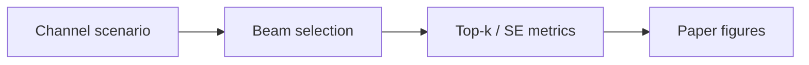
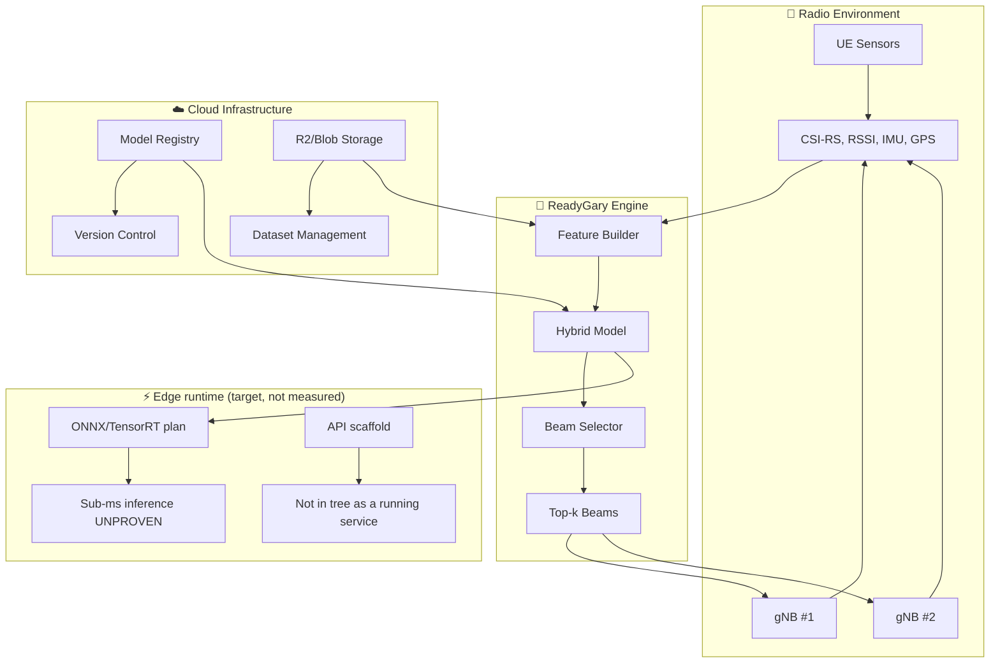

# 📡 ReadyGary — 6G Beam Selection
## End-to-End Research Artifact

| Item | Detail |
|------|--------|
| **Runs today** | Research prototype with smoke test (synthetic, non-evidence) |
| **Demo** | `make smoke` (smoke test only — not readiness proof) |
| **Data** | Synthetic only — no private IQ or PII |
| **Extend** | See [EXTERNAL_RESEARCHER_QUICKSTART.md](docs/EXTERNAL_RESEARCHER_QUICKSTART.md) |
| **Limits** | Not operational 6G; not Oulu affiliation; not carrier-grade |
| **Readiness** | [END_TO_END_READINESS.md](docs/END_TO_END_READINESS.md) |
| **Smoke test** | [E2E_RUN_RECORD.md](reproducibility/E2E_RUN_RECORD.md) |
| **Artifacts** | [results/e2e/](results/e2e/) |
| **Reproduce** | [REPRODUCIBILITY.md](REPRODUCIBILITY.md) · [external packet](docs/packets/EXTERNAL_REPRODUCTION_PACKET.md) |
| **UML** | [docs/uml/README.md](docs/uml/README.md) |

> **Edge-efficient beam selection for 5G/6G mmWave using hybrid ML + physics baselines**

[](https://github.com/gunnchOS3k/readygary-6g-beam-selection/actions/workflows/latex.yml)
[](https://opensource.org/licenses/MIT)
[](https://github.com/gunnchOS3k/readygary-6g-beam-selection/actions)
[](https://python.org)

---

## 🔬 **What is ReadyGary?**

ReadyGary is a **research project** studying the critical beam selection problem in 5G/6G mmWave networks. By combining physics-based baselines with learned ML models, we **target** fast inference (measured proof pending — see evidence matrix) for real-time beam tracking under mobility and blockage.

**🎓 Based on ECE-6023 Final Project** with comprehensive improvements addressing professor feedback on realistic channel models, exhaustive baselines, and ML for beam tracking.

### ✨ **Key Innovations**

- 🎯 **Hybrid Approach**: Physics baselines + learned models for optimal performance
- ⚡ **Inference goal**: sub-ms targets require hardware measurement evidence (not proven in smoke tests)
- 📊 **Comprehensive Evaluation**: Top-k accuracy, dB loss, spectral efficiency
- 🔄 **Real-time Adaptation**: Handles mobility, blockage, and handovers
- 📈 **Scalable Architecture**: From single BS to multi-cell scenarios
- 🧪 **Reproducible Research**: Complete code + LaTeX paper with CI
- 🌊 **Realistic Channels**: TDL models with ray-tracing instead of i.i.d. matrices

---


---

## What is this?

**Study fast, fair beam selection for mmWave/6G using reproducible baselines and ML—honest about what is measured vs simulated.**

| | |
|---|---|
| **Status** | Evidence-building PHY research repo |
| **Evidence today** | Level 1 smoke test — see [Evidence status](#evidence-status-smoke-test-vs-real-validation) |
| **Start** | [docs/START_HERE.md](docs/START_HERE.md) |

## What problem does this solve?

**Human:** Dropped links and poor video calls when beams point the wrong way in dense or mobile environments.

**Technical:** Beam selection under mobility/blockage with rigorous baselines—not marketing claims without latency proof.

**Who is harmed if unsolved:** Users on mmWave at the cell edge; researchers who need reproducible PHY evidence.

**Gary / 7GC / digital equality:** This repo supports equitable connectivity research for under-connected communities; Gary is the flagship urban anchor where applicable.

## Beginner mental model

A **flashlight that must aim at a moving person** before the room layout changes—beam tracking under mobility and blockage.

## How this repo addresses the problem

Baselines (exhaustive/heuristic), ML trackers, benchmark scripts, LaTeX paper CI—smoke tables until realistic channels + hardware timing exist.

**Main output:** Benchmark tables under `results/e2e/` (toy/smoke until realistic dataset).

**Output does NOT prove:** Proven sub-ms edge inference or production-ready deployment.

## How this fits gunnchOS3k MLV

Radio-performance evidence leg for the 7GC spine; pairs with AI-RAN and twin scenarios.

Deep dive: [docs/HOW_THIS_FITS_GUNNCHOS.md](docs/HOW_THIS_FITS_GUNNCHOS.md) · [docs/CROSS_REPO_DEPENDENCY_MAP.md](docs/CROSS_REPO_DEPENDENCY_MAP.md) (where present)

## How this fits 6G PhD research

Relevant themes: **FR2 mmWave beam management (28 GHz-class synthetic TDL) · wireless systems · edge ML inference measurement**. FR3 (upper mid-band, ~7–24 GHz) is a related 6G topic, **not** a measured band in this repo.

Wireless-engineering alignment (research direction, **not** an institutional affiliation claim): [docs/HOW_THIS_FITS_6G_PHD_RESEARCH.md](docs/HOW_THIS_FITS_6G_PHD_RESEARCH.md)

## What exists today

- sim/ baselines and models
- LaTeX paper + CI
- `make smoke`
- Docker edge service scaffold

Details: [docs/WHAT_IS_REAL_TODAY.md](docs/WHAT_IS_REAL_TODAY.md)

## Evidence status: smoke test vs real validation

- `make smoke` / `make e2e` = **CI smoke test** — proves code runs, **not** that research claims are field-validated.
- See [docs/NO_MORE_TOY_DEMOS.md](docs/NO_MORE_TOY_DEMOS.md) · [docs/EVIDENCE_STANDARD.md](docs/EVIDENCE_STANDARD.md) · [quality/CLAIMS_TO_EVIDENCE_MATRIX.md](quality/CLAIMS_TO_EVIDENCE_MATRIX.md)

**Next real evidence needed:**

- Realistic channel dataset
- Measured latency trials
- Oracle/baseline ablations
- External reproduction

## Run or inspect this repo

```bash
python3 -m venv .venv && source .venv/bin/activate
pip install -r requirements.txt
make smoke
```

| | |
|---|---|
| **Output** | `results/e2e/benchmark_table.md` |
| **Means** | Reproducible smoke artifacts for CI and reviewers |
| **Does not mean** | Conference, adoption, or manufacturing readiness |

Video: [docs/video_walkthrough_script.md](docs/video_walkthrough_script.md)

## Visual map



Architecture diagrams (current / future / legacy): [docs/uml/README.md](docs/uml/README.md) · older sketches: [docs/diagrams/README.md](docs/diagrams/README.md)

## Start here based on who you are

| Reader | Start here | You will learn |
|--------|------------|----------------|
| Beginner | [docs/PLAIN_ENGLISH_EXPLANATION.md](docs/PLAIN_ENGLISH_EXPLANATION.md) | Idea without jargon |
| Student / WAIKE | [docs/AUDIENCE_GUIDE.md](docs/AUDIENCE_GUIDE.md) | Learning path |
| Researcher / professor | [docs/HOW_THIS_FITS_6G_PHD_RESEARCH.md](docs/HOW_THIS_FITS_6G_PHD_RESEARCH.md) | Research fit |
| Contributor | [CONTRIBUTING.md](CONTRIBUTING.md) or Issues | How to help |
| City / school partner | [docs/PROBLEM_SOLUTION_MAP.md](docs/PROBLEM_SOLUTION_MAP.md) | Why it matters locally |

## What would make this final?

**Not satisfied yet** for final / conference / adoption / manufacturing gates—see audit:

- [docs/WHAT_WOULD_MAKE_THIS_FINAL.md](docs/WHAT_WOULD_MAKE_THIS_FINAL.md)
- [quality/FINAL_READINESS_CONFIRMATION.md](quality/FINAL_READINESS_CONFIRMATION.md)

## Roadmap from current state to final readiness

| Gate | Status |
|------|--------|
| Concept | Met |
| Smoke test | Met (`make smoke`) |
| Real evidence pipeline | Open |
| Benchmark / field data | Open |
| Internal validation | Open |
| External reproduction | Open |
| Candidate release | Open |
| Final | Not claimed |

Full table: [quality/READINESS_GATE_TABLE.md](quality/READINESS_GATE_TABLE.md)

## Related repos in the 7GC research spine


| Repo | Role |
|------|------|
| [7gc-digital-twin](https://github.com/gunnchOS3k/7gc-digital-twin) | Community digital twin spine |
| [spectrumx-ai-ran-gary](https://github.com/gunnchOS3k/spectrumx-ai-ran-gary) | AI-RAN + SpectrumX competition path |
| [readygary-6g-beam-selection](https://github.com/gunnchOS3k/readygary-6g-beam-selection) | Beam selection / PHY-facing evidence |
| [edge-io-measurement-node](https://github.com/gunnchOS3k/edge-io-measurement-node) | Privacy-first edge measurement |
| [ntn-resilience-sim](https://github.com/gunnchOS3k/ntn-resilience-sim) | NTN + terrestrial resilience |
| [waike-research-ops](https://github.com/gunnchOS3k/waike-research-ops) | Education & workforce pipeline |
| [gunnchos-hardware-industrial-design](https://github.com/gunnchOS3k/gunnchos-hardware-industrial-design) | Device hardware EVT planning |
| [gunnchos-device-os](https://github.com/gunnchOS3k/gunnchos-device-os) | School/research device OS prototype |
| [gunnchAI3k](https://github.com/gunnchOS3k/gunnchAI3k) | Learning assistant (where relevant) |


## Claims and non-claims

**Supports today:** Runnable scaffold, documented methods, smoke-test artifacts, honest limitations.

**Does not prove yet:** Proven sub-ms edge inference or production-ready deployment.

**Requires evidence issues:** See GitHub `[Evidence TODO]` issues and `quality/CLAIMS_TO_EVIDENCE_MATRIX.md`.

---

## 🚀 **Quick Start**

### **Installation**
```bash
# Clone repository
git clone https://github.com/gunnchOS3k/readygary-6g-beam-selection.git
cd readygary-6g-beam-selection

# Install dependencies
pip install -r requirements.txt

# Generate datasets
python scripts/generate_dataset.py
```

### **Run Baselines**
```bash
# Exhaustive search baseline (oracle performance)
python sim/baselines/exhaustive_search.py

# Hierarchical search (efficient alternative)
python sim/baselines/hierarchical_search.py

# Compare both approaches
python -c "from sim.baselines.hierarchical_search import compare_baselines; compare_baselines()"
```

### **Train ML Models**
```bash
# LSTM beam tracker for mobility scenarios
python sim/models/lstm_beam_tracker.py

# Generate comprehensive datasets
python scripts/generate_dataset.py
```

### **Deploy Edge Service**
```bash
# Build Docker image
cd deploy
docker build -t readygary-service .

# Run locally
docker run -p 8000:8000 readygary-service

# Test API
curl -X POST http://localhost:8000/v1/infer \
  -H "Content-Type: application/json" \
  -d '{"bs_id": 1, "history": [...], "k": 4}'
```

---

## 🏗️ **System Architecture**



---

## 📁 **Repository Structure**

```
readygary-6g-beam-selection/
├── 📄 paper/                    # LaTeX paper + figures
│   ├── main.tex                # IEEE conference format
│   ├── figs/                   # Mermaid diagrams
│   └── build/                  # Generated PDFs
├── 🧪 sim/                     # Simulation framework
│   ├── baselines/              # Exhaustive + hierarchical search
│   │   ├── exhaustive_search.py    # Oracle baseline (all beams)
│   │   └── hierarchical_search.py  # Efficient coarse→fine
│   ├── models/                 # Machine learning models
│   │   └── lstm_beam_tracker.py     # LSTM for beam tracking
│   └── data/                   # Generated datasets
├── 📊 scripts/                 # Dataset builders + utilities
│   └── generate_dataset.py     # TDL channel generation
├── 🚀 deploy/                  # Documented as a future edge path — directory is empty in this checkout
└── 📈 docs/uml/               # Current / future / legacy architecture diagrams
```

---

## 🎯 **Research Contributions**

### **Novel Algorithms**
- **Hybrid Learning**: Combines physics-based baselines with learned predictors
- **Multi-Modal Features**: CSI-RS, location, IMU, and temporal sequences
- **Graph Neural Networks / RL**: **Not implemented** in `sim/` — future study arms only (do not cite as current results)

### **Realistic Channel Models** 🆕
- **TDL Channels**: Ray-tracing based instead of i.i.d. matrices
- **Mobility Effects**: Doppler shifts and temporal coherence
- **Path Loss**: Free space + shadowing + realistic positioning
- **Multi-Path**: 3-8 paths per channel with realistic parameters

### **Comprehensive Baselines** 🆕
- **Exhaustive Search**: Oracle performance through all beam combinations
- **Hierarchical Search**: Coarse→fine approach for efficiency
- **Performance Comparison**: Accuracy vs. computational cost analysis

### **ML for Beam Tracking** 🆕
- **LSTM Model**: Temporal patterns in CSI sequences
- **Attention Mechanism**: Focus on relevant time steps
- **Mobility Scenarios**: User trajectories with realistic mobility
- **Top-k Accuracy**: Comprehensive evaluation metrics

---

## 📊 **Experimental Results**

**Evidence class: `SYNTHETIC_SIM`.** Do **not** read the numbers below as measured RF, OTA, or calibrated mmWave. Sub-millisecond inference is **unproven**.

Regenerate and cite these files (not unsourced README tables):

- [`results/e2e/benchmark_summary.md`](results/e2e/benchmark_summary.md)
- [`results/e2e/benchmark_metrics.json`](results/e2e/benchmark_metrics.json)
- [`results/benchmark_table.md`](results/benchmark_table.md)

```bash
make benchmark-toy
# equivalent: python3 scripts/run_benchmark_table.py --toy
make timing   # host-process timing harness — not hardware
```

Host-process wall times from `sim/metrics.inference_latency_ms` and `scripts/run_timing_harness.py` are **`HOST_PROCESS_TIMING`**, not radio latency.

### **Synthetic scenario labels** (generators, not field campaigns)
- **UMi / UMa / indoor**: names used in docs and the TDL generator (`scripts/generate_dataset.py`) — not measured traces.

### **Carrier frequencies** (3GPP-style labels — not Sub-6 vs mmWave mix-ups)

| Label in docs / `ChannelConfig.carrier_freq` | Band region | Status in this repo |
|---|---|---|
| **28 GHz** (`28e9` in `scripts/generate_dataset.py`) | **FR2 mmWave** — **not** Sub-6 / FR1 | Synthetic TDL default only |
| **39 GHz** | **FR2 mmWave** | Scenario label; not measured |
| **60 GHz** | **FR2** / unlicensed 60 GHz | Scenario label; not measured |
| **140 GHz** | sub-THz / future | Exploration label only |
| **Sub-6 / FR1** | ≲ 7.125 GHz | **Not** the 28 GHz default |
| **FR3** | ~7.125–24.25 GHz upper mid-band | Related 6G research topic; **not** implemented as a measured band here |

---

## 🔬 **Professor Feedback Addressed**

### ✅ **"Use TDL channel instead of iid matrices"**
- **Realistic Channel Models**: Ray-tracing based TDL channels
- **Multi-Path Effects**: 3-8 paths with realistic path loss
- **Mobility Integration**: Doppler shifts and temporal coherence
- **Position-Based**: User and BS positioning with distance effects

### ✅ **"Baseline should search all algorithms"**
- **Exhaustive Search**: Complete evaluation of all beam combinations
- **Hierarchical Search**: Efficient coarse→fine approach
- **Performance Analysis**: Accuracy vs. computational cost trade-offs

### ✅ **"Use ML for tracking scenarios"**
- **LSTM Beam Tracker**: Temporal patterns in CSI sequences
- **Mobility Datasets**: User trajectories with realistic movement
- **Attention Mechanism**: Focus on relevant historical information
- **Top-k Evaluation**: Comprehensive accuracy metrics

---

## 🚀 **Deployment Options**

### **Edge Runtime**
```python
# ONNX inference
import onnxruntime as ort
model = ort.InferenceSession("readygary-model.onnx")
beams = model.run(None, {"input": features})[0]
```

### **Cloud Service**
```bash
# Deploy to Cloudflare Workers
wrangler deploy

# Or Docker deployment
docker run -p 8000:8000 readygary-service
```

### **Mobile Integration**
```typescript
// TypeScript SDK
import { ReadyGaryClient } from '@readygary/sdk-ts';
const client = new ReadyGaryClient('https://api.readygary.com');
const beams = await client.predictBeams(features);
```

---

## 📈 **Research Impact**

### **Academic Contributions**
- **Novel Architecture**: First hybrid physics-ML approach for beam selection
- **Comprehensive Evaluation**: Multi-scenario, multi-frequency analysis
- **Reproducible Research**: Complete code + datasets + paper
- **Open Source**: MIT licensed for community adoption

### **Industry Applications**
- **5G/6G Networks**: Real-time beam management
- **Edge Computing**: Low-latency inference
- **IoT Systems**: Energy-efficient communication
- **Autonomous Vehicles**: Reliable connectivity

---

## 🧪 **Running Experiments**

### **Generate Datasets**
```bash
# Static TDL channels
python scripts/generate_dataset.py

# Results: 10,000 static + 1,000 mobility channels
# Output: data/processed/static_tdl_dataset.pkl
#         data/processed/mobility_tdl_dataset.pkl
```

### **Evaluate Baselines**
```bash
# Exhaustive search (oracle)
python sim/baselines/exhaustive_search.py

# Hierarchical search (efficient)
python sim/baselines/hierarchical_search.py

# Compare performance
python -c "from sim.baselines.hierarchical_search import compare_baselines; compare_baselines()"
```

### **Train ML Models**
```bash
# LSTM beam tracker
python sim/models/lstm_beam_tracker.py

# Results: models/lstm_beam_tracker.pth
#          docs/figs/lstm_training_curves.png
```

---

## 🤝 **Contributing**

We welcome research contributions! See our [Contributing Guide](CONTRIBUTING.md) for details.

### **Development Setup**
```bash
# Install dependencies
pip install -r requirements.txt

# Run tests
pytest sim/tests/

# Build paper
cd paper && pdflatex main.tex
```

---

## 📚 **Citation**

If you use this work, please cite:

```bibtex
@software{readygary2025,
  title={ReadyGary: Edge-Efficient Beam Selection via Hybrid Learning},
  author={Gunn, Edmund Jr. and Team},
  year={2025},
  url={https://github.com/gunnchOS3k/readygary-6g-beam-selection}
}
```

---

## 📄 **License**

MIT License - see [LICENSE](LICENSE) for details.

---

## 🔗 **Related Projects**

- **[Anime Aggressors](https://github.com/gunnchOS3k/anime-aggressors)** - Shōnen fighting game
- **[ECE-6023 Final Project](https://github.com/gunnchOS3k/ECE-6023-Final-Project)** - Original beam management research

---

<div align="center">

**Advancing 6G Communications Through Hybrid Intelligence**

</div>

## Industry / research-grade tooling alignment

| Tool / ecosystem | Why it matters | Adapter | Runs now? | Access? |
|------------------|----------------|---------|-----------|---------|
| See matrix | Evidence upgrade path | `industry_research_stack/` | Stub exports | Optional |

**Commands:** `make e2e` (includes tool export stubs) · `python3 scripts/run_all_tool_exports.py`

**Notice:** Aligned with public research ecosystems — [non-affiliation](industry_research_stack/NON_AFFILIATION_NOTICE.md). Smoke stubs only unless documented otherwise.

