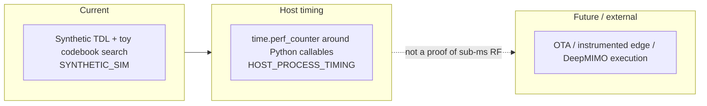

# UML and architecture diagrams — front door

GitHub-visible architecture package for **readygary-6g-beam-selection**. Faculty, collaborators, and external reproducers should start here with **Markdown pages** (`docs/uml/current/`, `future/`, `legacy/`) — **not** raw `.puml` or `.mmd` files.

This is an **RQ2** artifact in the thesis *Resilience-Aware Service Continuity in Heterogeneous 6G Networks: Cross-Layer Orchestration for Resource-Constrained Devices* (three RQs only). ReadyGary is the PHY-facing **beam-selection** evidence leg. It is **not** an institutional affiliation claim.

## Lanes (how to read the repo)

| Lane | Meaning |
|------|---------|
| **Current (shipped code)** | Toy / synthetic TDL generators, exhaustive + hierarchical DFT-codebook search, LSTM tracker **module**, `sim/metrics.py`, `scripts/run_benchmark_table.py --toy` |
| **Completed research extension** | Campus-radio profile YAML + tool-adapter **stubs** (DeepMIMO / Sionna / Aerial) that export configs, not measured RF |
| **Future research-adoption** | Hardware timing, ONNX/TensorRT edge, DeepMIMO/Sionna **execution**, FR3 campaigns, OTA beam tracking — **targets** |

**Evidence (authoritative):** tables under `results/` generated by `make benchmark-toy` are **`SYNTHETIC_SIM`**. Host wall-clock from `inference_latency_ms` / `scripts/run_timing_harness.py` is **`HOST_PROCESS_TIMING`**. **Sub-ms inference is unproven.**

**Band terminology (authoritative):** 28 GHz in `scripts/generate_dataset.py` (`carrier_freq = 28e9`) is **FR2 mmWave**, **not** Sub-6 / FR1. FR3 (~7–24 GHz) is **not** a measured band here.

Discipline (lanes, Markdown-first, current vs future vs legacy, committed SVG optional) follows the SpectrumX UML **governance** pattern. Diagrams in this folder are **this repo’s** structure — they are **not** copies of SpectrumX AI-RAN diagrams.

---

## Browse the diagrams (primary entry points)

| Index | Contents |
|-------|----------|
| **[Current index](current/index.md)** | Component; beam/model class; inference sequence; beam-tracking state; timing; edge deployment |
| **[Future index](future/index.md)** | ONNX/TensorRT, hardware latency, realistic channels |
| **[Legacy index](legacy/index.md)** | Generic `docs/diagrams/*.mmd` sketches and unsourced numeric tables — **do not cite** as measured RF |

**Governance**

- [Traceability matrix](traceability_matrix.md) — diagram element ↔ source path
- [Latency evidence](../LATENCY_EVIDENCE.md) · [Dataset provenance](../DATASET_PROVENANCE.md) · [Ablation notes](../ABLATION_NOTES.md)

---

## Source vs rendered assets

| Asset | Role on GitHub |
|-------|----------------|
| **`docs/uml/current/*.md`**, **`future/*.md`**, **`legacy/*.md`** | **Primary:** Mermaid in fenced ` ```mermaid ` blocks renders inline |
| **`docs/diagrams/*.mmd`** | Older sketches; indexed under **legacy** when they over-simplify or omit evidence class |
| **`docs/uml/rendered/*.svg`** | Optional committed PlantUML output |

PlantUML sources, if added, should use `!pragma layout smetana` so SVG generation does **not** require Graphviz `dot`.

```bash
./docs/uml/render_plantuml.sh
```

---

## Mini legend (evidence)



---

## Related docs

- [`REPRODUCIBILITY.md`](../../REPRODUCIBILITY.md)
- [`docs/packets/EXTERNAL_REPRODUCTION_PACKET.md`](../packets/EXTERNAL_REPRODUCTION_PACKET.md)
- [`docs/09_LIMITATIONS_AND_NON_CLAIMS.md`](../09_LIMITATIONS_AND_NON_CLAIMS.md)
