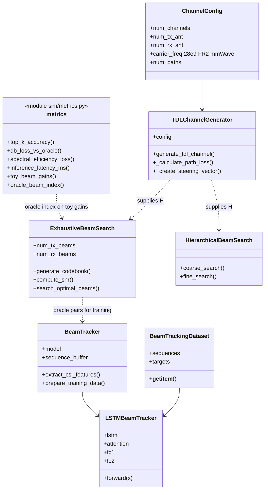

# Class — beam search and tracker models (current)

| | |
|---|---|
| **Status** | **Current** — types and functions in `sim/` and `scripts/generate_dataset.py` |
| **Purpose** | Bind diagram names to source. LSTM training is **optional** (needs torch); the toy benchmark does **not** load a trained checkpoint. |

**Not in this class model:** GNN, RL policy, FastAPI handlers — they are not present as implementations.

[← Current index](index.md)
