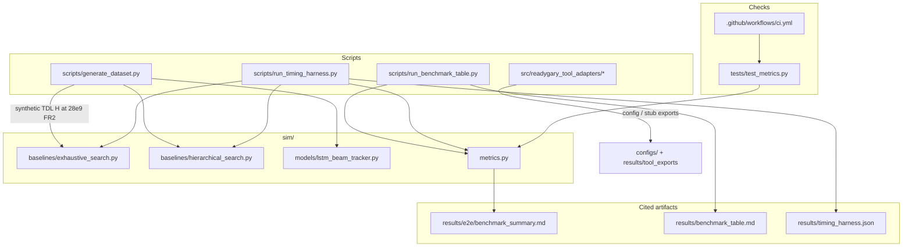

# Component — current

| | |
|---|---|
| **Status** | **Current** |
| **Purpose** | Modules that exist and are invoked by `make test` / `make benchmark-toy` / `make timing`. |
| **Does not include** | FastAPI/gRPC server, Docker image, ONNX session — those paths are **future** (`deploy/` is empty). |

[← Current index](index.md)
