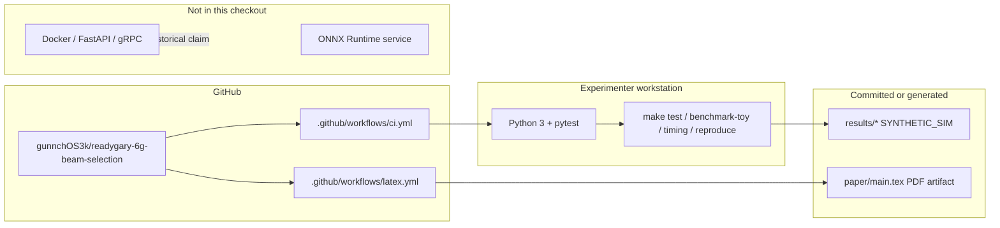

# Deployment — current execution surfaces

| | |
|---|---|
| **Status** | **Current** — honest about the empty `deploy/` directory |
| **Purpose** | Where Python, pytest, and GitHub Actions actually run. |

Edge service commands in the README (`docker build`, `/v1/infer`) describe a **future** path. There is no `deploy/` payload to build today.

[← Current index](index.md)
