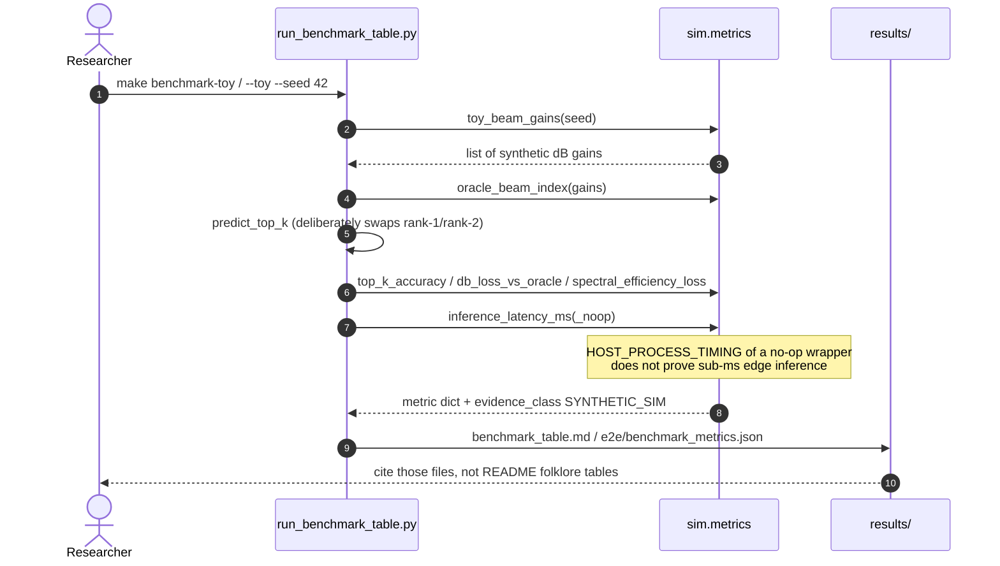

# Sequence — toy inference / benchmark (current)

| | |
|---|---|
| **Status** | **Current** — `python3 scripts/run_benchmark_table.py --toy` |
| **Evidence** | `SYNTHETIC_SIM`. Latency field is `HOST_PROCESS_TIMING` of a tiny Python callable, **not** radio or accelerator inference. |

LSTM `forward` is **not** on this path. Optional tracker training is `python sim/models/lstm_beam_tracker.py` when torch is installed.

[← Current index](index.md)
