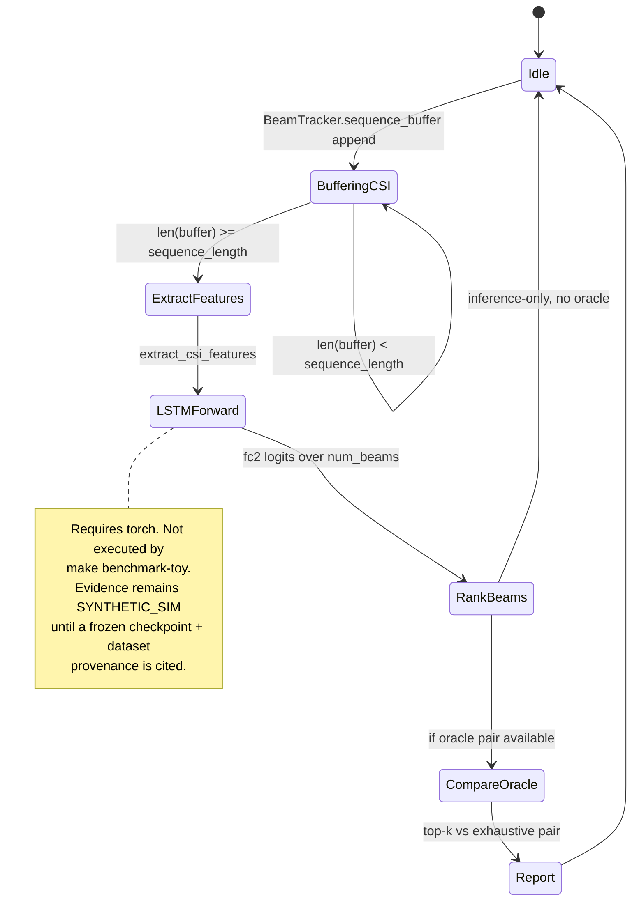

# State machine — LSTM beam tracker (current)

| | |
|---|---|
| **Status** | **Current** code path in `sim/models/lstm_beam_tracker.py` |
| **Purpose** | Temporal CSI buffer → LSTM+attention → codebook index. Trained weights are **not** a CI artifact. |

Blockage and mobility in `TDLChannelGenerator` are **parameterized synthetic paths** (Doppler phase increment), not field traces.

[← Current index](index.md)
