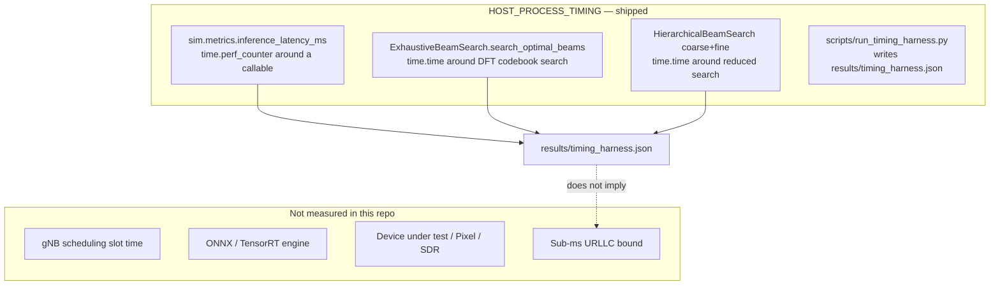

# Timing — what is actually measured (current)

| | |
|---|---|
| **Status** | **Current** |
| **Purpose** | Separate host Python timers from RF / accelerator latency. |

Classification table: [`docs/LATENCY_EVIDENCE.md`](../../LATENCY_EVIDENCE.md).

[← Current index](index.md)
