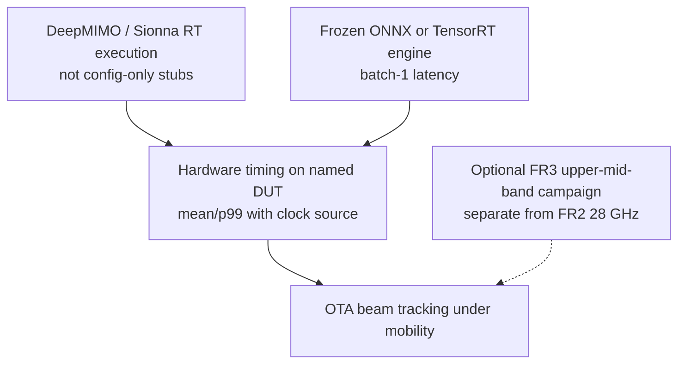

# Future — edge inference and realistic RF

Targets for evidence upgrade. None of these are `SYNTHETIC_SIM` replacements until artifacts exist.

Until then, cite `results/` with class `SYNTHETIC_SIM` and latency class `HOST_PROCESS_TIMING`. Sub-ms remains **unproven**.
